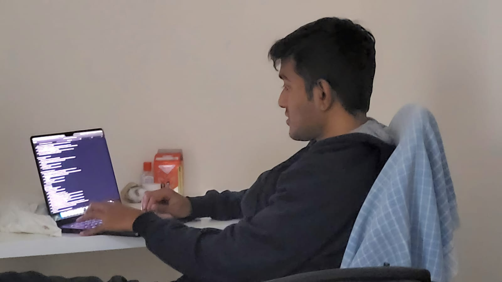

I'm a software engineer working at [Gojek/Goto](https://www.gojek.io/) in the Data Science Platform and Engineering team.
I help Data Science teams to deploy and scale machine learning workloads to earn my daily bread.

Currently brainstorming on developing GoTo's AI-based fintect voice assistant named [Dira](https://www.gotocompany.com/en/news/press/goto-launches-new-ai-strategy-with-the-introduction-of-dira-the-first-ever-ai-based-fintech-voice-assistant-in-bahasa-indonesia) with the team!

My interests(in no particular order) lie in distributed systems, databases, infra, mythology, sci-fi, world history - ([goodreads](https://www.goodreads.com/user/show/149694972-rushikesh)) and now GPUs ^ ^ 

Hie, Yup, that's me fixing tests!!(IKR) 
