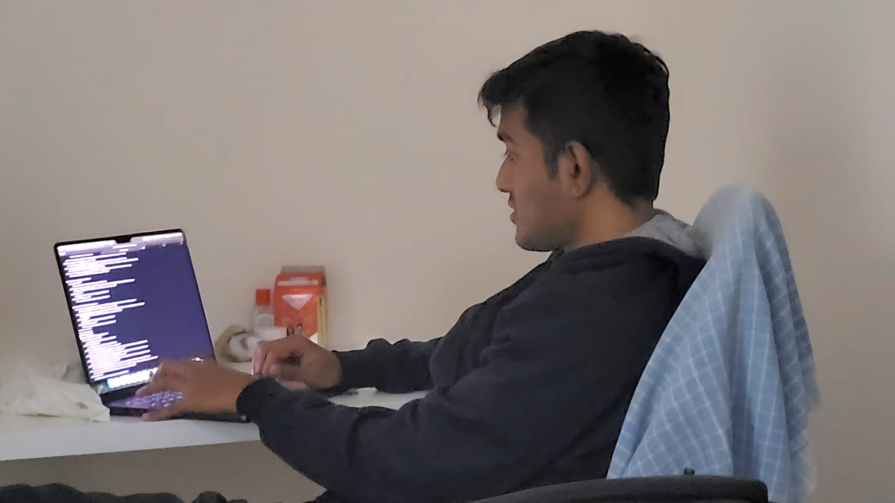

  I'm a software engineer working at [Gojek/Goto](https://www.gojek.io/) in the Data Science Platform and Engineering team.
  
  Currently developing AI-based applications by leveraging GoTo's In-house [LLM Sahabat AI](https://sahabat-ai.com/en).
  
  My interests(in no particular order) lie in distributed systems, databases, infra, mythology, sci-fi, 
  world history - ([goodreads](https://www.goodreads.com/user/show/149694972-rushikesh)) and now GPUs. > > 
  
  
  Hiee, Yup, that's me fixing tests!!(IKR) 
  

🔎 Search by [Tags](https://paulismatrix.github.io/tags/)
  
👓 Did you read this? [Is my Toddler a Stochastic Parrot?](https://archive.is/hzBe3)

Contact me [at](mailto:1999.yadwade@gmail.com). I'm most active on [Twitter](https://x.com/1999Yadwade).

Subscribe to my [RSS feed](https://paulismatrix.github.io/index.xml)
