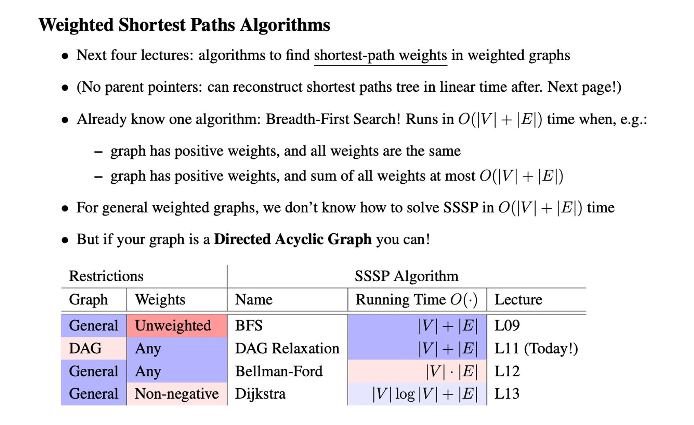

---
tags:
  - dsa
publish: true
description: Notable algorithms used to solve variety of problems in computer science.
---

My notes on different algorithms used to solve variety of problems in computer science.

## Binary Search 

* [Handbook](https://leetcode.com/problems/binary-search/discuss/423162/Binary-Search-101-The-Ultimate-Binary-Search-Handbook) on Binary Search.

* [Template](https://leetcode.com/discuss/general-discussion/786126/python-powerful-ultimate-binary-search-template-solved-many-problems) on solving problems.

* **Eytzinger** Binary Search: 
    * Core idea - if the access pattern is root of the tree and then one of its two children, put those children physically close to the root, so they'll all be on the same cache line.
    * https://algorithmica.org/en/eytzinger
    * https://news.ycombinator.com/item?id=35739036

* [BinaryHeaph](ttps://opendatastructures.org/ods-java/10_1_BinaryHeap_Implicit_Bi.html) - An implicit BT.

## Graph Traversal Algorithms    

* **BFS** :
    * [MIT-BFS notes](https://ocw.mit.edu/courses/6-006-introduction-to-algorithms-spring-2020/resources/mit6_006s20_lec9/)
    * Multi-Source [BFS](https://leetcode.ca/all/286.html)

* **DFS** :
    * [MIT-DFS notes](https://ocw.mit.edu/courses/6-006-introduction-to-algorithms-spring-2020/resources/mit6_006s20_lec10/) 

* **Weighted Shortest Path algos** : 
    * 
        
    * Different [traversal](https://medium.com/geekculture/how-to-pick-the-correct-graph-traversal-algorithms-for-your-faang-interviews-1c260294395d) algorithms.

    * [Difference](https://softwareengineering.stackexchange.com/q/158613) between Bellman-Ford vs Dijkstra vs Floyd-Warshall algorithm.

## Dynamic Programming

* **Recursive/DP Algorithm Design Paradigm (SRTBOT)** :  

    * **S**ubproblem definitions → The hardest part, to come up with similar subproblems.
    * subproblems can be defined/visualized in terms of `prefixes[:i]`, `sufixes[i:]`, `substrings/subarrays s[i:j]`.
    * ex, in LCS, prefix array would be to start from the last n...0, `text[row][col]` and ask which one to pick next?, `1 + text[row+1][col+1]` or `max(text[row][col+1], text[row+1][col])`.
    * and suffix array would be to start from 1..n and check have we already calculated an LCS before? `1 + text[row-1][col-1]` or `max(text[row-1][col], text[row][col-1])`.

    * **R**elate subproblems solutions recursively. 

    * **T**opological order on subprobs to guarantee acyclic relationships, `Directed Acyclic Relationship`. 

    * **B**ase case of recursion.

    * **O**riginal problem: solve via subproblems. 

    * **T**ime analysis.
    
* **Tips** :

    * Generally a bottom up(tabulation) approach wherein you calculate the results of smaller subproblems first and then move up to the bigger ones. As opposed to recursive/memo solutions wherein you start upfront and check for base conditions to exit. 

    * Try to figure out which variables to consider for the size of dp table. How can we store intermediate results for those particular values. 

    * Try visualising in terms of a **directed acyclic graph(topological order)**, where to reach at node of index i, you connect its related previous nodes(i-1, i-2,…0) based on some condition if there is.  
    Ex : In [LIS](https://leetcode.com/problems/longest-increasing-subsequence/description/) wherein you pick `dp[j] iff arr[j] < arr[i]` where `j -> 0,i`.

    * DP doesn’t always necessarily mean recursion + memoisation(to reuse the already computed results). In DP **you always optimally** pick a subproblem and build your way up. [Related discussion](https://blog.racket-lang.org/2012/08/dynamic-programming-versus-memoization.html).

    * For example, in Perfect Squares problem(consider n=12), using recursion, you end up picking up 3 as well, but that is not optimal since `9+1+1+1` is not the correct answer. The answer is when you pick 2 (`4+4+4` ) so you in recursion you end up doing **extra computations**. This is avoided in DP since you have already picked up the most optimal path(subproblem). In this case, it’s starts with 2.
                
    * **Reference videos** :
        * [5 Simple Steps for Solving Dynamic Programming Problems](https://youtu.be/aPQY__2H3tE?si=9xsyOGSQwT0OeFSP)
        * [Dynamic Programming Explained (Practical Examples)](https://youtu.be/Sz9yH-RDAgo?si=W-dhNoOdU9StKdWK)
        * [Mastering Dynamic Programming - A Real-Life Problem](https://youtu.be/rE5h11FwiVw?si=QzNBSHJE1VTiNIzs)
        * [Top 5 Dynamic Programming Patterns for Coding Interviews - For Beginners](https://youtu.be/mBNrRy2_hVs?si=w6yzutggdJ_4G_3v)

* **Helpful resources** : 
    * [Patterns](https://leetcode.com/discuss/general-discussion/458695/dynamic-programming-patterns).
    * [Roadmap](https://www.reddit.com/r/leetcode/comments/14o10jd/the_ultimate_dynamic_programming_roadmap/)
    * [Sample problems](https://leetcode.com/discuss/general-discussion/1000929/solved-all-dynamic-programming-dp-problems-in-7-months) and [Sample solutions](https://leetcode.com/discuss/general-discussion/662866/dp-for-beginners-problems-patterns-sample-solutions)
    * [More on DP](https://answeraggregator.quora.com/Dynamic-programming)

* **Few examples** : 
    * [Longest Common Subsequence](https://ics.uci.edu/~eppstein/161/960229.html) 
    * [Minimum Edit Distance](https://web.stanford.edu/class/cs124/lec/med.pdf)
    * [Min-Max](https://leetcode.com/problems/predict-the-winner/) dp kinda problem.
    * [Maximum Profit in Job Scheduling](https://youtu.be/JLoWc3v0SiE?si=wrbZVyIOBYyPZdMN)
    * LCS&LAP, LIS, Russian Envelopes, Box Stacking(Max Height of Cuboids), Perfect squares, Coin Change, Largest Divisible Subset, Number of dice rolls with target sum, longest ideal subsequence.
    * **Path Problems** : Minimum path sum, Num Unique paths, Shortest distance in bin matrix, sum paths in matrix divisible by k.

## Recursion

* Typically in recursion, the over all time complexity is the (number of calls or number of branches at a particular level, the branching factor) `^` (the depth of those branches, i.e the height, how deep you are branching it further).

* For example in Binary Tree, if you have a branching factor of 2 then TC : `2^N` where N=num of nodes in the tree. You can optimise this by maintaining a memo so if you find a pre-computed result, just return it which decreases the TC to `O(N)`.

* **Understanding recursion** : 
    * [How recursion works](https://compileralchemy.substack.com/p/cursing-and-re-cursing-what-if-we)
    * [5 Simple Steps for Solving Any Recursive Problem](https://youtu.be/ngCos392W4w?si=8yakGSkc8IZQ_XOM)

* **Visualize recursion** :
    * https://recursion.vercel.app/
    * https://pythontutor.com/
    * https://www.recursionvisualizer.com/ 
    
## Bit Manipulation

* [Notes](https://www.hackerearth.com/practice/notes/bit-manipulation/) on bit manipulation techniques.
* [Examples](https://www.reddit.com/r/programming/comments/17d3any/are_there_any_other_examples_of_the_use_of_bit/) 
* [Patterns](https://leetcode.com/discuss/interview-question/3695233/All-Types-of-Patterns-for-Bits-Manipulations-and-How-to-use-it).
* Bitmaps/Bitsets [usecase](https://www.vikramoberoi.com/using-bitmaps-to-run-interactive-retention-analyses-over-billions-of-events-for-less-than-100-mo/)
* Simple bitmaps [implementation](https://go.dev/play/p/Wv-9Wxn-4Lj) in golang.
     
## Bloom Filters

* A nice [visualization](https://samwho.dev/bloom-filters/)
* Bloom filters [usage](https://codeconfessions.substack.com/p/cpython-bloom-filter-usage)
* [More](https://twitter.com/arpit_bhayani/status/1772103827476378092) on bloom filters.

## Topological Sort

* [Intro](https://leetcode.com/discuss/general-discussion/1078072/Introduction-to-Topological-Sort) to topological sort

## Hashing algorithms

* [DHash](https://www.hackerfactor.com/blog/index.php?/archives/529-Kind-of-Like-That.html) algorithm.

## Cache Eviction Algorithms

* $O(1)$ algorithm for implementing [LFU](http://dhruvbird.com/lfu.pdf) cache eviction scheme.
* Improvements on FIFO as compared to LRU based on the power of [lazy promotion and quick demotion](https://blog.jasony.me/system/cache/2023/06/24/fifo-lru)
* [Sieve](https://cachemon.github.io/SIEVE-website/blog/2023/12/17/sieve-is-simpler-than-lru/) eviction algorithm and its [implementation](https://github.com/mfleming/sieve) in python.
* [Adaptive Cache Replacement](https://gist.github.com/pior/da3b6268c40fa30c222f) algorithm.
* [Cache algorithms](https://github.com/trauzti/cache) implemented in python
 
## Special/Extra Algorithms

* Newton’s method to [find sqrt](https://runestone.academy/ns/books/published/thinkcspy/MoreAboutIteration/NewtonsMethod.html)
* Lagrange’s four [square theorem](https://www.geeksforgeeks.org/lagranges-four-square-theorem/)
* Brian Kernighan’s algorithm to count num of [set bits](https://yuminlee2.medium.com/brian-kernighans-algorithm-count-set-bits-in-a-number-18ab05edca93)
* Probabilistic [Morris Counting algorithm](https://en.wikipedia.org/wiki/Approximate_counting_algorithm)
* [Expression Evaluations](https://cp-algorithms.com/string/expression_parsing.html) 
* [Substring search](https://www-igm.univ-mlv.fr/~lecroq/string/) algorithms available.
* [Maze](https://www.astrolog.org/labyrnth/algrithm.htm) following algorithms.
* Problem on [Fermat’s two square theorem.](https://leetcode.com/problems/sum-of-square-numbers/solutions/5324381/number-theory-with-fermat-legendre-etc-0ms-beats-100) 

## Miscellaneous

* 6.006 MIT - Intro to algorithms
    * [Youtube playlist](https://www.youtube.com/playlist?list=PLUl4u3cNGP63EdVPNLG3ToM6LaEUuStEY)
    * [Notes](https://ocw.mit.edu/courses/6-006-introduction-to-algorithms-spring-2020/pages/lecture-notes/)
* [Challenging](https://austinhenley.com/blog/challengingalgorithms.html) data structures and algorithms.
* [Advanced](https://courses.csail.mit.edu/6.851/spring21/) DSA.
* Algorithms for [Competitive programming](https://cp-algorithms.com/)
* Algorithms [practice](https://protegejj.gitbook.io/algorithm-practice)
* Algorithms [gitbook](https://labuladong.gitbook.io/algo-en)
* Algorithms by [Jeff Erickson](https://jeffe.cs.illinois.edu/teaching/algorithms/)
* Algorithms by [Simon Tatham](https://www.chiark.greenend.org.uk/~sgtatham/algorithms/)