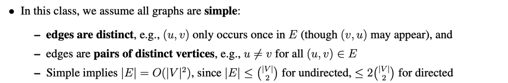

---
tags:
  - dsa
publish: true
description: Notable data structures used to solve variety of problems in computer science.
---

My notes on different data structures used to solve variety of problems in computer science.

## Simple Graphs 
No self loops, all edges are distinct.

* 

* **For an undirected graph** :
`(|V|₂)` represents the binomial coefficient `n choose 2`, which is the number of ways to choose 2 distinct elements from a set of n elements. This gives the maximum possible number of undirected edges in a simple graph with |V| vertices, where each edge connects two distinct vertices without any duplicates.

* **For a directed graph** : 
`2(|V|₂)` represents twice the binomial coefficient. This is because in a directed graph, for every pair of distinct vertices, there can be two possible edges (one in each direction). So the maximum number of directed edges is twice the maximum number of undirected edges.

* **More Readings** : 
  * [Graph types](https://www.hillelwayne.com/post/graph-types/)
  * [The Hitchhiker’s Guide to Graphs](https://graphs.apiad.net/)

## Trees

* **Heap** : Heap is a **complete binary tree.** 

  * `heappush()` and `heappop()` take $log(N)$. `heappush()` starts from **leaf** upto to the **root** node, and `heappop()` in the **opposite** direction comparing the element with the current node,  traversing the height of the tree which $log(N)$.  So for push(`siftup`)/pop(`siftdown`) we first maintain the complete binary tree property then max/min heap property.  

  * **heapsort** is $Nlog(N)$ since after each element you pop, elements need to be reordered to maintain the max/min heap property takes $log(N)$

  * Heapify takes $O(N)$ wherein it does `siftdown` while generating the heap. Starts with leaf nodes and decides whether or not to swap depending on the child nodes instead of looking at parent nodes in heappush or `siftup`.

* **Interval Search Trees** : 
  * [How do they work?](https://youtu.be/q0QOYtSsTg4)
  * [Problem](https://leetcode.com/problems/merge-intervals/editorial/) solved using the same.

* **Radix Trees** : 
  * [Pruning radix tree](https://seekstorm.com/blog/pruning-radix-trie/)
  * Corresponding [implementation](https://github.com/olympos-labs/pruning-radix-trie) for fast ranked autocompletes.

* Balancing a [BST](https://leetcode.com/problems/balance-a-binary-search-tree/description/comments/1576586)

* Drawing [presentable trees](https://llimllib.github.io/pymag-trees/)

## Miscellaneous

* Data Structures [Visualizations](https://www.cs.usfca.edu/~galles/visualization/Algorithms.html)
* [Challenging](https://austinhenley.com/blog/challengingalgorithms.html) data structures and algorithms.
* [More Data Structures](https://opendatastructures.org/ods-python/)
* Evaluating data structures : [Data Calculator](http://daslab.seas.harvard.edu/datacalculator/)
* [Obscure Data Structures](https://www.reddit.com/r/programming/comments/1cj48q7/what_are_some_cool_but_obscure_data_structures/)
* Data structures for [Data Intensive Applications-Tradeoffs and Design Guidelines](https://cs-people.bu.edu/mathan/publications/fnt23-athanassoulis.pdf)
* Collections library in python but having [sorted containers](https://grantjenks.com/docs/sortedcontainers/)
* [Linked Lists](https://rootfriend.tistory.com/entry/Linux-Kernel-Linked-List-Explained) in linux kernel explained.
* [Advanced](https://courses.csail.mit.edu/6.851/spring21/) DSA.