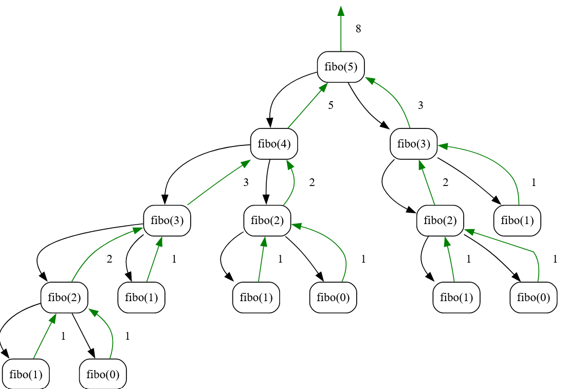

---
tags:
  - talks
  - pg
publish: true
date: 2024-08-08
description: postgres optimizer methodology.
source: https://www.youtube.com/watch?v=XA3SBgcZwtE
origin: Robert Haas.
---

## Join Planning 

Joins are pretty common in SQL queries. SQL has a lot of features, but only few of them are as frequently used
as joins. So planning and executing them efficiently has a big impact on query performance. 

If you do an inner join across N tables then the possible join orders grows towards `N!` since we could pick any of the 
`N` tables as the driving table and join with any of the remaining `N-1` <br>tables and then its result to `N-2` and so on..

Also just knowing the order of joins is not enough. The join method you would use such as Hash Join, Merge Join,
Nested Loop influences the query performance.

**How does PostgreSQL plan joins?**

It uses the `bottom-up` DP strategy to avoid recomputing similar subproblems. 

Suppose we are performing a join of 6 tables then number of possible ways it can be done is:<br>
```
15 possible two-way joins
20 possible three-way joins
15 possible four-way joins
6 possible five-way joins
1 possible six-way joins
```
So basically, number of possibilities for `r-way` joins of `n tables` = $\binom{n}{r} = n!/ r!(n-r)!$

Here, there are total of 6 tables of 'base relations' and 57 'join relations' for a total of 63 'relations'.
So figure out the best possible 'relation' starting with the smaller tables.

When number of join tables exceed the `geqo_threshold`(set to 12), then it switches to 'Genetic Query Optimizer' [GEQO](https://www.postgresql.org/docs/current/geqo-pg-intro.html#GEQO-PG-INTRO-GEN-POSSIBLE-PLANS), which essentially tries a bunch of join orders at random and picks the best one. 

In hopes of finding the most optimal path, we evaluate multiple strategies for each 'relation'. This is cool but expensive
cause then the query planner is busy evaluating multiple paths which is time consuming.

**What makes strategy worth keeping?**

Consider query: `SELECT * FROM foo JOIN bar ON foo.x=bar.x WHERE foo.y=1;`

Potential strategies for foo: 
* a-index scan on `foo.y` where `y=1` seems promising. 
* b-sequential scan would be better if most of the rows have `y=1`. 
* c-index scan on `foo.x` and then filtering on `y=1` avoids a sort if merge join is selected.
* d-only way to perform an efficient Nested Loop join is when foo is very big and bar is small.

We should be able to know if (a) is cheaper or expensive than (b), but its hard to reject anything else at this stage cause what if we find a more suitable join path.
(c) is going to be more than (a) or (b), but gives us sorted data. Can't really say 
about (d) yet, cause we don't know how many times we need to do it.

**Information at hand while executing a query**

We have limited information about the number of rows involved in a `bottom up` approach since its starts with a base case and works its way up saving results of each subproblem to find the optimal plan. 

This is different than `top down` where we have access to `N` at the start and then we basically do a recursive branch and bound; breaking down into its own branch/subproblem. 
This is helpful but evaluating each decision tree in a recursion is time consuming as well.

Consider Fibonacci recursion tree viz for reference: `fibo(N) = fibo(N-1) + fibo(N-2)`

* 

## Statistics

Postgres store stats about the rows which allows the planner to considerably estimate row-counts to generate better query plans.

For example: We can store stats like `cardinality` (number of unique row values in a column). If the cardinality is low i.e a column has a bunch of duplicate values then we can avoid an index scan needlessly over duplicate values. A sequential scan would be a better option in that case since you might end up scanning most of the column rows anyways.

`ANALYZE` command gathers various pieces of statistical information that are used for query planning. Stored in tables `pg_stats` and `pg_class`.

`CREATE STATISTICS` creates a stats object tracking the data about a specified table, MV or a foreign table. 
It captures co-relations or functional dependencies between the different colums which might help the planner in coming up with a better plan. 
This data is stored in the same database in table `pg_statistic_ext`.

**Bad row-count estimates**

Postgres might come up with not so good counts for queries like this:<br> `SELECT * FROM foo where a = 1 ORDER BY b LIMIT 1;`

The planner can either:
* index scan on a for all rows where a=1 and keep the one with lowest b value.
* index scan on b until it finds the first row where a=1

If table has only a few rows where a=1, then first strategy is great. But if the table has many rows where a=1, then second strategy works better.


## Appendix
* [Postgres planner-optimizer](https://www.postgresql.org/docs/current/planner-optimizer.html)
* [How postgres generates all possible query plans](https://www.youtube.com/watch?v=pj7Fxr8cUJI)
* [Postgres Analyze command](https://www.postgresql.org/docs/current/sql-analyze.html)
* [Postgres Planner Statistics](https://www.postgresql.org/docs/current/planner-stats-details.html)
* [Example stats usage](https://www.citusdata.com/blog/2018/03/06/postgres-planner-and-its-usage-of-statistics/)
* 