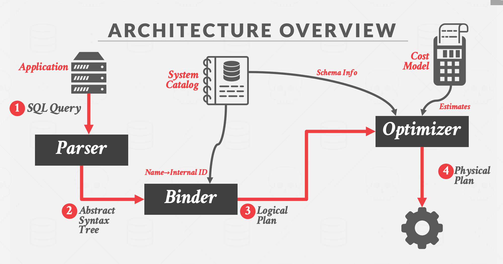
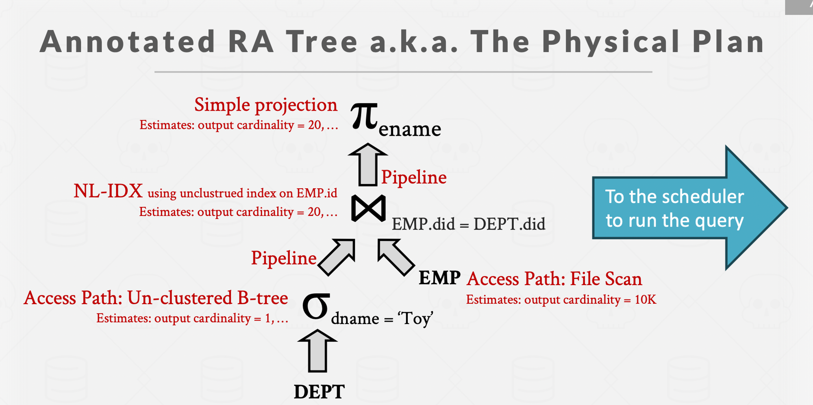

---
tags:
  - cmu
  - db
publish: true
date: 2024-07-09
description: Query optimizations techniques in database systems.
---

## Query Optimizer

Query optimizer is a database component that optimizes the execution of the query plans according to heuristic or cost based rules.
* 

There are two high-level strategies for query optimization.
* **Static or Heuristics rules** : They match portions of the query with known patterns to assemble a plan. These rules transform the query to remove inefficiencies. Although these rules may require consultation of the catalog to understand the structure of the data, they never need to examine the data itself.
* Perform filters as early as possible (predicate pushdown).
* 
* Select only those columns which are necessary (projection pushdown).
* 
* Split sub-queries into individual composable groups and focus on optimizing those (Subquery optimization).
* 
* Nested sub-queries rewrite. Basically flatting the sub-query to remove the additional level of nesting.
* 

* **Cost based rules** : As opposed to rules based, what better you can do is determine the cost of each plan depending on various factors like data distribution of your records, cardinality, etc to find out the best optimal plan on the fly.

## Query Plan architecture

Logical vs Physical Plans:

* **Logical** : The optimizer generates a mapping of a logical algebra expression to the optimal equivalent physical algebra
expression. The logical plan is roughly equivalent to the relational algebra expressions in the query.
* **Physical** : Physical operators define a specific execution strategy using an access path for the different operators in
the query plan. Physical plans may depend on the physical format of the data that is processed (i.e. sorting,
compression).
* There does not always exist a one-to-one mapping from logical to physical plans.
* 

## Cost Estimations

* Database systems use cost models to estimate the cost of executing a plan.
* The cost of each query plan is evaluated based on few metrics : 
  * **CPU** : small cost, but tough to estimate.
  * **Disk I/O** : number of random/sequential page accesses.
  * **Memory** : amount of DRAM/RAM (buffer pool usage) used.
  * **Network** : number of msgs sent over the wire.
* 

## Plan Enumeration

The query optimizer evaluates different plans for a query and selects the most optimal one after exhausting all the plans or after some timeout.

###  Single-Relation Query Plans 

Picking the best access method for accessing the records/tuples : 
* Sequential Scan
* Binary Search (clustered indexes)
* Index Scan (Use BTree indexes to retrieve the records instead of doing random I/Os)

### Multi-Relation Query Plans 

When the SQL query is referring to multiple tables/joins. 

* **Bottom-up** (System R) :
* Use static rules to perform the initial optimisation. Then use DP to determine the best join order for tables using a divide-and-conquer search method.
* Break query up into blocks and generate the logical operators for each block.
* For each logical operator, generate a set of physical operators that implement it
* Then, iteratively construct a ”left-deep” tree that minimizes the estimated amount of work to execute the plan.
* Examples : IBM System R, DB2, MySQL, Postgres, most open-source DBMSs.
* 

* **Top-Down** (Volcano Model) : 
* Start with a logical plan of what we want the query to be. Perform a branch and bound search to traverse the plan tree by covering logical operators into physical operators. 
* Keep track of global best plan during search.
* 

## Appendix

* Query Planning and Optimization
    * [Youtube](https://www.youtube.com/watch?v=ePGPVJCyCAk)
    * [Notes](https://15445.courses.cs.cmu.edu/fall2023/notes/14-optimization1.pdf)
    * [Slides](https://15445.courses.cs.cmu.edu/fall2023/slides/14-optimization.pdf)
* [SQL Query Optimization](https://people.eecs.berkeley.edu/~brewer/cs262/queryopt.html)
* [Overview](https://web.stanford.edu/class/cs345d-01/rl/chaudhuri98.pdf) of Query Optimization in Relational Systems.
* [Cost based](https://courses.cs.duke.edu/compsci516/cps216/spring03/papers/selinger-etal-1979.pdf) optimizer in System R.
* [What is Query Optimizer for](https://justinjaffray.com/what-is-a-query-optimizer-for/)
* [A tale of Query Optimization](https://parallelthoughts.xyz/2019/05/a-tale-of-query-optimization/)
* Optimizations in Joins Reordering
    * [Introduction](https://docs.pingcap.com/tidb/stable/join-reorder/) to Join Reorder.
    * [Adaptive](https://db.in.tum.de/~radke/papers/hugejoins.pdf) optimization of Very Large Join Queries.
    * [Dynamic Programming](https://15721.courses.cs.cmu.edu/spring2020/papers/20-optimizer2/p539-moerkotte.pdf) in Join Reorderings.
* [SubQueries](https://www.scattered-thoughts.net/writing/materialize-decorrelation/) optimizations.
* [Heuristic Rules](https://github.com/XiaoMi/soar/blob/fab04633b12ba1e4f35456112360150a6d0d1421/advisor/rules.go#L119) implemented in [Soar](https://github.com/XiaoMi/soar/)
* 