---
tags:
  - cmu
  - db
publish: true
date: 2024-07-08
description: Query planning and execution techniques used in database systems.
---

## Introduction

When you execute a query, its modelled in the form of a **relational algebraic operators tree**.
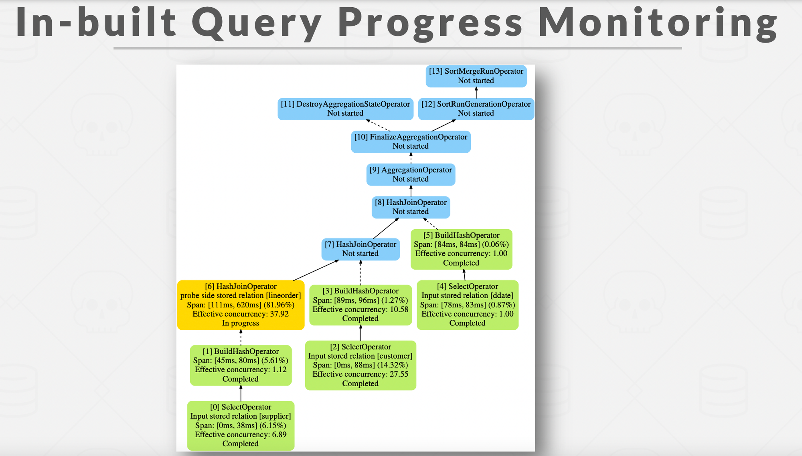

Query Engines can process the record tuples in two directions based on which the processing models are defined

* **Top-To-Bottom** : Start with the root and pull data up from its children. Tuples are always passed with function calls. This is `Pull based or Consumer oriented approach`.
* **Bottom-To-Top** : Start with leaf nodes and push data to their parents. Allows for tighter control of caches/registers in pipelines. This is `Push based or Producer oriented approach`. More amenable to dynamic query re-optimisation. The DP approach :)
* More here - [Query Engines: Push vs Pull](https://justinjaffray.com/query-engines-push-vs.-pull/)

## Data Processing models

Different methods to emit the record tuples.

### Iterator/Volcano/Pipeline Model

Pull Based and Consumer oriented 
* 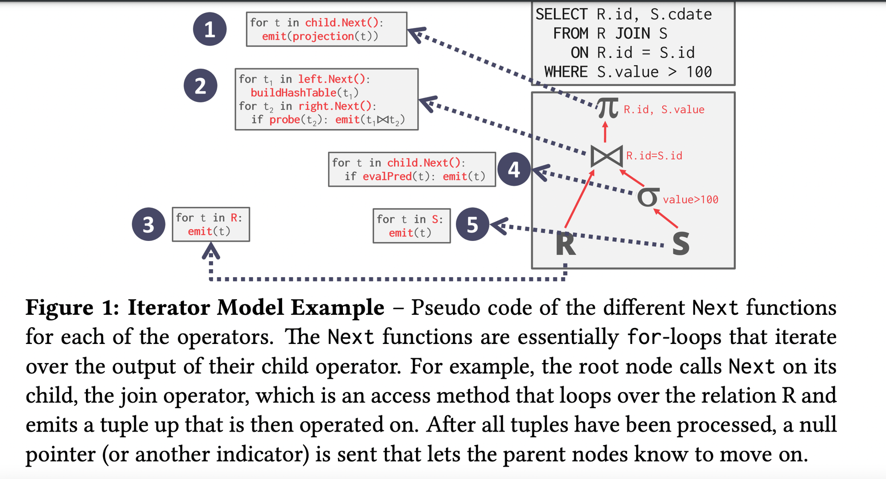
* Implemented by most of the dbs today with some optimisations.
* Issue with this model is there are too many context switching or operator execution since you are calling `.Next()` multiple times at each level.

### Materialisation Model

* 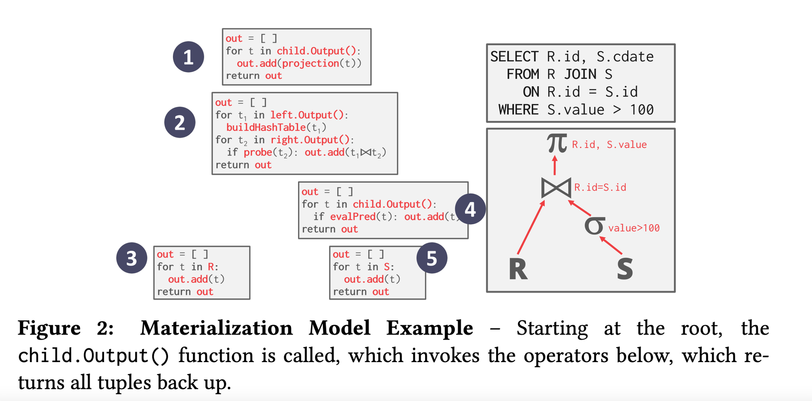
* Basically avoid this excessive context switching(lower execution overhead) and process each operator at once and then emit all the data at once. The operator materialises(we can further optimise this by using early or late materialisation as discussed before) its output as a single result. 
* The dbms can push down hints(eg. LIMIT) to avoid scanning too many tuples. For example, instead of looping over all the records of table, just consider those many records which is specified in the `LIMIT` clause and return up. This is one of the optimising technique by the query executor.
* The output can be either whole tuple(NSM) or subsets of columns(DSM)
* Better for OLTP workloads cause queries access a small no of tuples at a time. Not good for OLAP which generally have large intermediate results.

### Vectorized Model

* 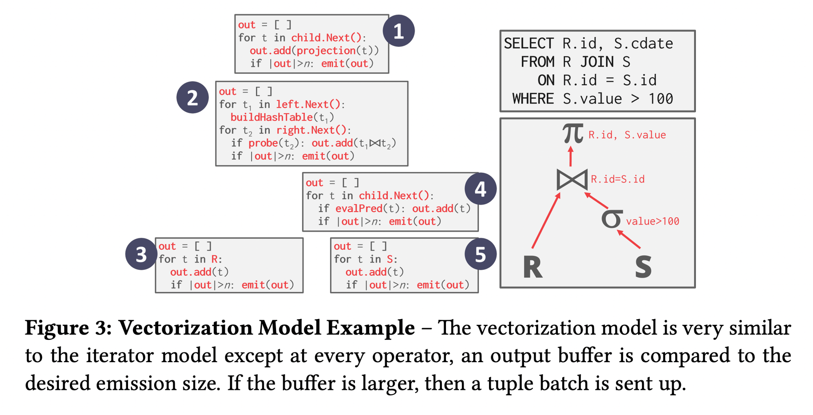
* Kinda combination of above both models. Call `.Next()` but instead of returning single tuples, return them in batches. 
* The operator’s internal loop processes multiple tuples at a time. Size of the batch can vary based on hardware or query properties.

## Access Methods 

We defined the control flow logic above how do we actually access the database records. Three basic approaches.

### Sequential Scan 

* For each page in the table, retrieve it from the buffer pool → iterate over each tuple and check predicate(the different conditions in the `WHERE, HAVING,etc` clauses) whether to include it or not. 
* DBMS maintains an internal `cursor` that tracks the last page/slot it examined.
* Sequential Scan Optimisations:
    * Prefetching
    * Buffer Pool Bypass
    * Parallelisation
    * Heap Clustering
    * Late Materialisation (we saw earlier)
    * Data Skipping : 
    * **Approximate Queries(lossy)** - Execute queries on a sampled subset of the entire table to produce approximate results.  Examples: BlinkDB, Redshift, ComputeDB, XDB, Oracle, Snowflake, BigQuery, DataBricks.
    * **Zone Maps(Lossless)** - Pre-compute columnar aggregations per page that allow the dbms to check whether queries need to access it. Trade-off between page size vs filter efficacy.  Examples: Oracle, Vertica, SingleStore, Netezza, Snowflake, BigQuery.
    * 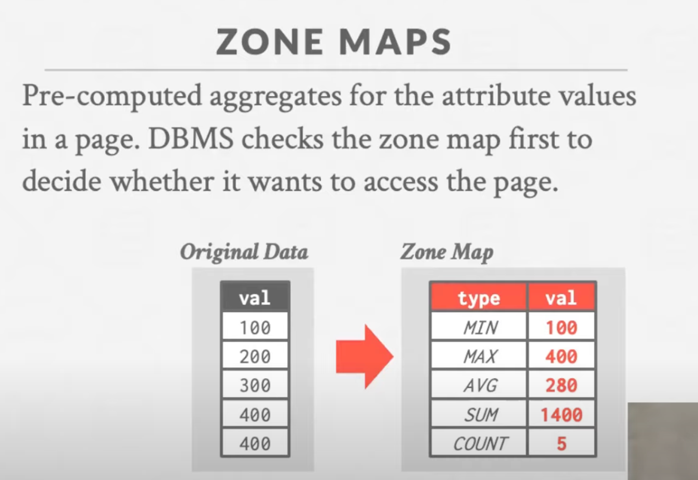

### Index Scans

* Dbms picks an index to find the tuples that the query needs. 
* Which index to use depends on:
    * What attributes the index contains.
    * What attributes the query references.
    * The attribute’s value domains like its cardinality, distribution, etc.
    * Predicate(Conditions in the sql query) Composition.
    * Whether the index has unique or non-unique keys.

### Multi-Index Scan

If there are multiple indexes that the dbms can use for query : 
* Computes sets of Record IDs using each matching index.(Don’t actually fetch the records yet)
* Combine these sets based on the query’s predicates (union vs intersect)
* Retrieve the records and apply any remaining predicates.
* The DBMS can use bitmaps, hash tables, or Bloom filters to compute record IDs through set intersection.
* 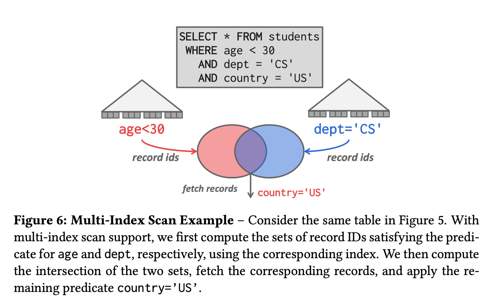
* More Readings : 
    * [DB2 multi-index scan](https://www.ibm.com/docs/en/dspafz/5.1.0?topic=report-multiple-index-scans)
    * [PG bitmap indexes](https://www.postgresql.org/message-id/12553.1135634231@sss.pgh.pa.us)
    * [MYSQL index merge](https://dev.mysql.com/doc/refman/8.0/en/index-merge-optimization.html)

### Modification Queries 

A caution in case of DML(UPDATE/DELETE/INSERT) queries.

* **UPDATE/DELETE** :
* Child operators(predicate operators at the bottom of the tree) pass Record IDs for target/parent tuples. 
* Must keep track of previously seen tuples. (so they aren’t processed again and the below problem doesn’t occur)
* Interesting [**halloween**](https://justinjaffray.com/the-halloween-problem/) problem that was discovered: 
    * Anomaly wherein an update operation changes the physical location of an updated tuple causing the scan operator to visit the same tuple multiple times if it still satisfies the predicate. 
    * Can occur on clustered tables or index scans. (This wouldn’t happen in case of **early materialisation** operator model since all the tuples would be fetched at once). Solution is just to keep track of visited record IDs per query.
* **INSERT** : 
* Choice1 : Materialise tuples inside of the operator.
* Choice2 : Operator inserts any tuple passed in from child operators.

## Expression Evaluation 

* To evaluate an expression tree at runtime, the dbms maintains a context handle that contains metadata for the execution, such as the current tuple, parameters, and table schema. The dbms then walks the tree to evaluate its operators and produce a result.
* Evaluating predicates in this manner is slow cause the dbms must traverse the entire evaluation tree and determine the correct action to take for each operator. 
* A better approach is just to evaluate the expression directly([JIT compilation](https://www.postgresql.org/docs/current/jit-reason.html)). Based on an internal cost model, the dbms would determine whether code generation will be adopted to accelerate a query.
* [How dbs execute expressions](https://notes.eatonphil.com/2023-09-21-how-do-databases-execute-expressions.html)
* 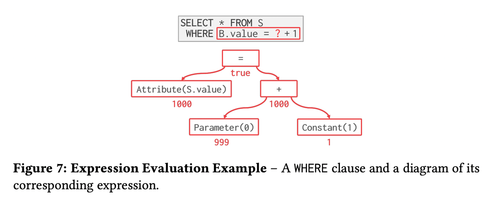

## Schedular

We saw about the data flow(retrieve record one by one, whole records at a time, or in batches) and control flow(top-to-bottom, bottom-to-top) but how can we optimise the control flow to efficiently execute each child query/operator!?

* The Schedular has a clean separation of data flow and control flow and it works well in batch or vectorisation mode. 
* The Schedular creates scheduling components(work orders), instead of calling the operator tree from top to bottom, it walks through the tree and puts scheduling works into a scheduling queue. The worker threads then basically fetch from this queue and execute them( Like assume `buildHash` and `probeHash` happening at the same time as the hash table builds up)
* In general, it has cleaner abstraction, dynamic optimization, in-built query suspension, better p9x performance and better manageability and debug-ability.
* Every database has some kind of schedular to efficiently execute the query plan after it has been decided by the planner.
* [Traditional control flow vs Schedular control flow](https://pages.cs.wisc.edu/~jignesh/publ/Quickstep.pdf)

## Process Worker Models

Worker is the dbms component responsible for executing tasks on the behalf of client and return the result. 
How is this worker allocated? 

* **Process/Worker**
    * 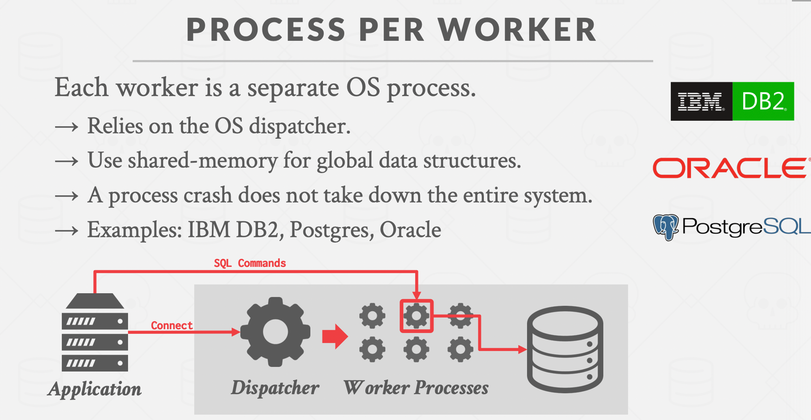

* **Thread/Worker**
    * 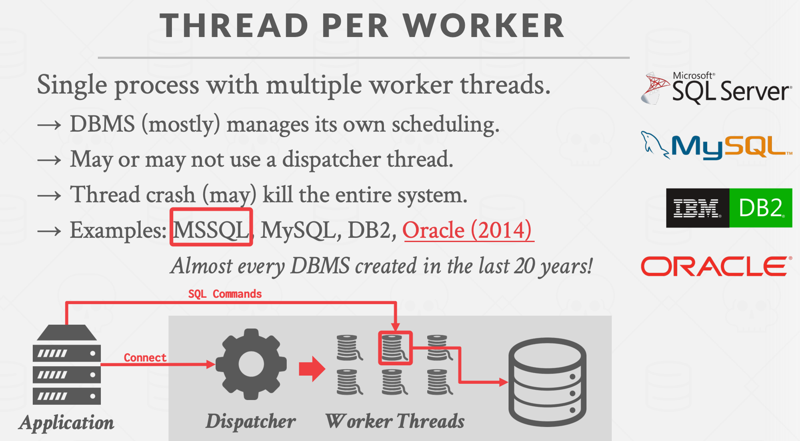

* **Embedded databases**
    * 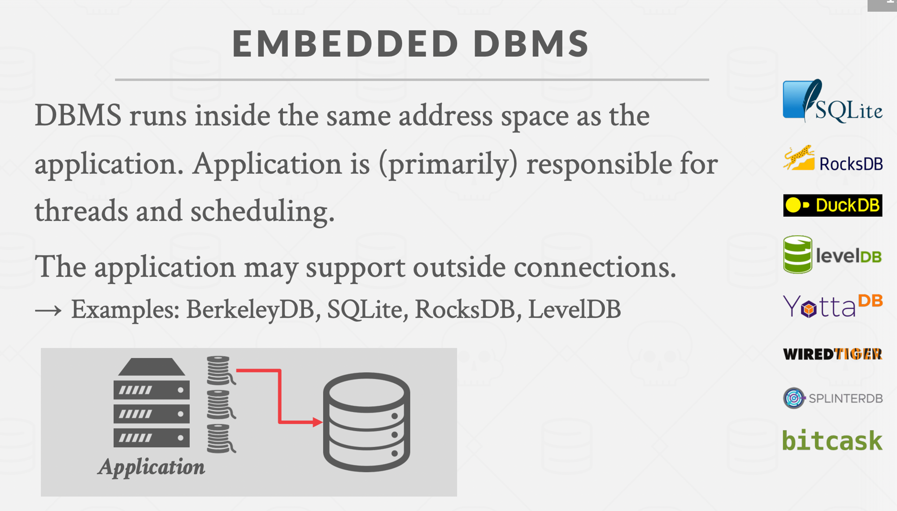

### Multi threaded execution

How can we parallelize operator execution in thread/worker model.

* **Inter-Operator Parallelism** : Execute multiple disparate, separate queries simultaneously.
    * A single thread for each operator/work.
    * The dbms overlaps operators in order to pipeline data from one stage to the next(bottom operator to the top operator) **without materialisation**(sorta iterator model wherein you emit the tuple as soon as the predicate satisfies). 
    This approach is widely used in stream processing, which are systems that continually execute a query over a stream of input tuples.
    * 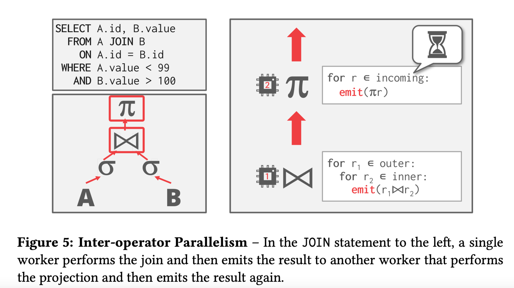

* **Intra-Operator Parallelism** : Execute operations of a single query/operator parallelly. 
    * 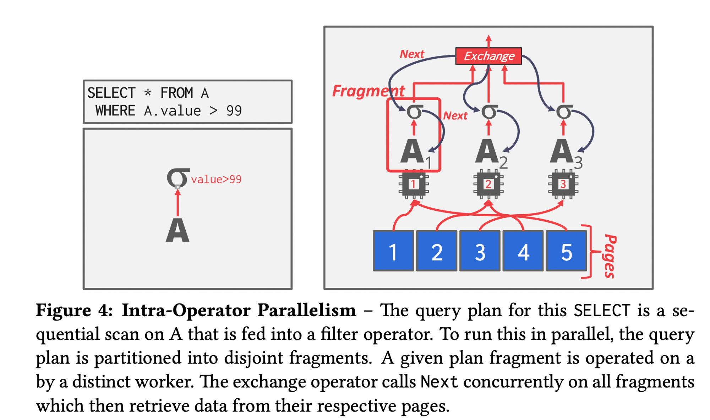
    * Multiple threads for each operator/work, co-ordinating between the results of each thread. Decreases latency for long-running queries, especially OLAP queries.
    * The query plan’s operators are decomposed into independent fragments that perform the same function on different (disjoint) subsets of data.
    * The dbms inserts an **exchange operator** into the query to coalesce the results from each thread/worker. There are three types of exchange operator :
        * **Gather** : Combine results from multiple workers into a single output stream. Most commonly used one.
        * **Distribute** : Split a single input stream into multiple output streams.
        * **Repartition** : Reorganise multiple input streams across multiple output streams. This allows the dbms take inputs that are partitioned one way and then redistribute them in another way.
        * 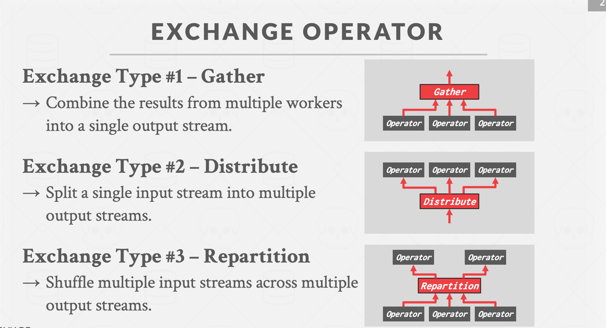
    * 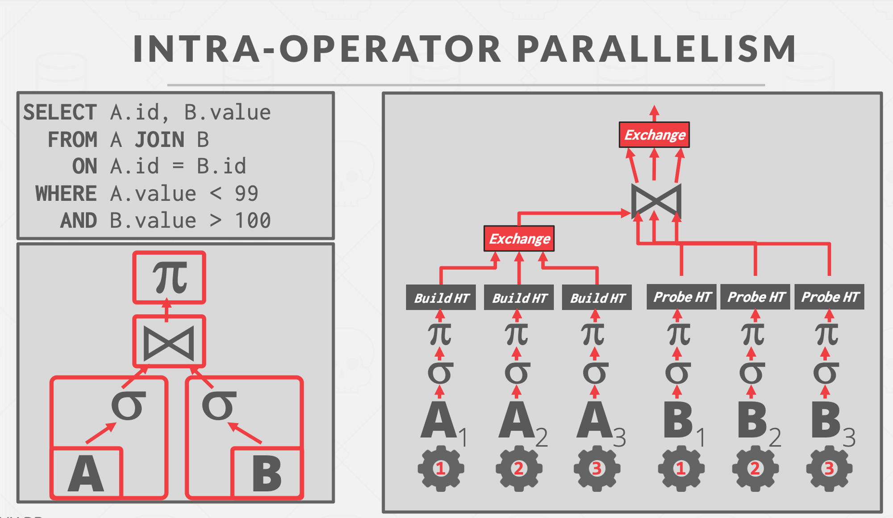

* **Bushy Parallelism** : 
    * A hybrid of intra-operator and inter-operator parallelism where workers execute multiple operators from different segments of the query plan at the same time.
    * 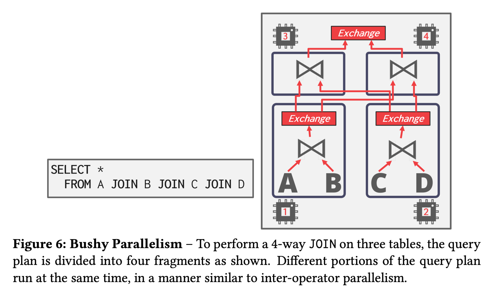

## IO Parallelism

DBMS use I/O parallelism to split installation(database records) across multiple devices.  
Two approaches to I/O parallelism are multi-disk parallelism and database partitioning.

* **Multi-disk Parallelism** : 
    * In multi-disk parallelism, the OS/hardware is configured to store the DBMS’s files across multiple storage devices. This can be done through storage appliances or RAID configuration. 
    * All of the storage setup is transparent to the DBMS so workers cannot operate on different devices because the DBMS is unaware of the underlying parallelism. 
    * 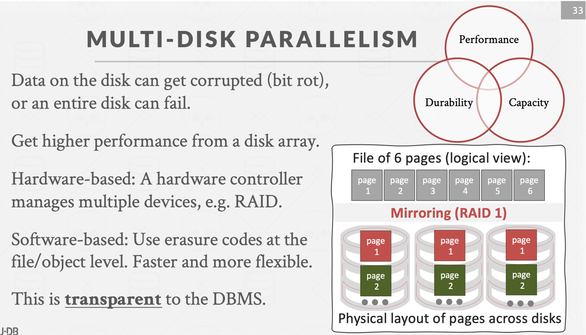

* **Database Partitioning** :  
    * The database is split up into disjoint subsets that can be assigned to discrete disks.
    * Some DBMSs allow for specification of the disk location of each individual database. This is easy to do at the file-system level if the DBMS stores each database in a separate directory. The log file of changes made is usually shared. 
    * The idea of logical partitioning is to split single logical table into disjoint physical segments that are stored/managed separately. 
    * Such partitioning is ideally transparent to the application. That is, the application should be able to access logical tables without caring how things are stored.

## Appendix

* Query Execution Part-I
    * [Youtube](https://www.youtube.com/watch?v=3F3FWgujN9Q)
    * [Notes](https://15445.courses.cs.cmu.edu/fall2023/notes/12-queryexecution1.pdf)
    * [Slides](https://15445.courses.cs.cmu.edu/fall2023/slides/12-queryexecution1.pdf)
* Query Execution Part-II
    * [Youtube](https://www.youtube.com/watch?v=MUjS0tIDnEE)
    * [Notes](https://15445.courses.cs.cmu.edu/fall2023/notes/13-queryexecution2.pdf)
    * [Slides](https://15445.courses.cs.cmu.edu/fall2023/slides/13-queryexecution2.pdf)
* Input query is translated into an [AST, parsed and evaluated](https://xuanwo.io/2024/02-what-i-talk-about-when-i-talk-about-query-optimizer-part-1/) by the query engine.
* SQLite rather generates a [bytecode](https://sqlite.org/draft/whybytecode.html) of the input query which is then evaluated by its virtual machine. 
* [How Query Engines work](https://howqueryengineswork.com/)
* Query engine of [mongodb](https://laplab.me/posts/inside-new-query-engine-of-mongodb/)
* [Query Plan Trees](https://buttondown.email/jaffray/archive/why-are-query-plans-trees/)
* Exploring postgres [query plan](https://notes.eatonphil.com/2023-11-19-exploring-a-postgres-query-plan.html)
* Building [Query Compilers](https://pi3.informatik.uni-mannheim.de/~moer/querycompiler.pdf)
* Typical order of [execution](https://sqlbolt.com/lesson/select_queries_order_of_execution) of a query.
* 
