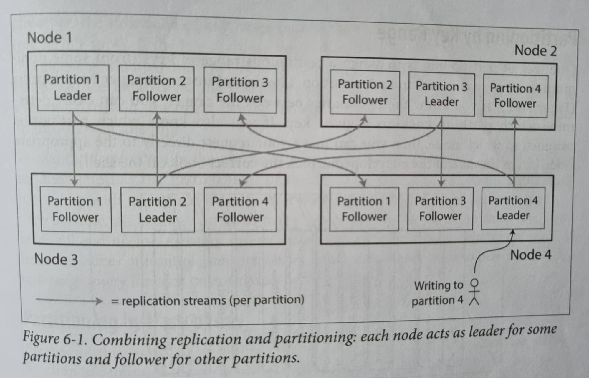
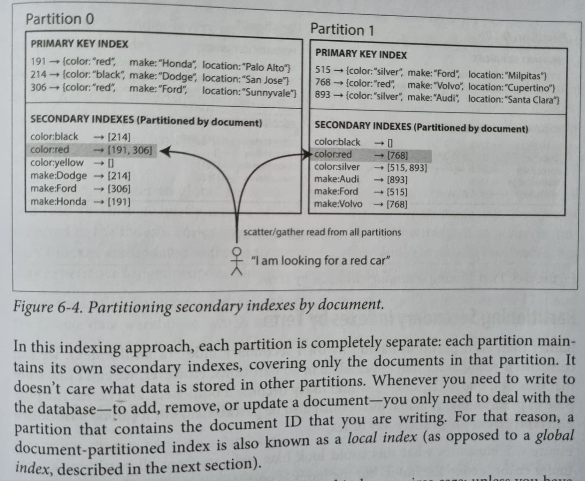
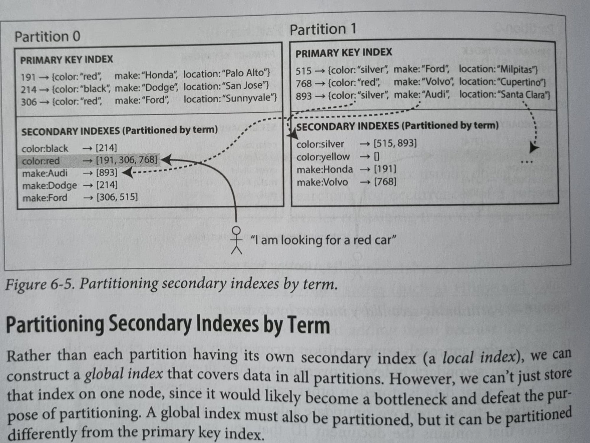
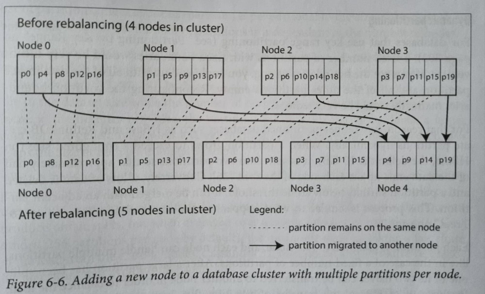
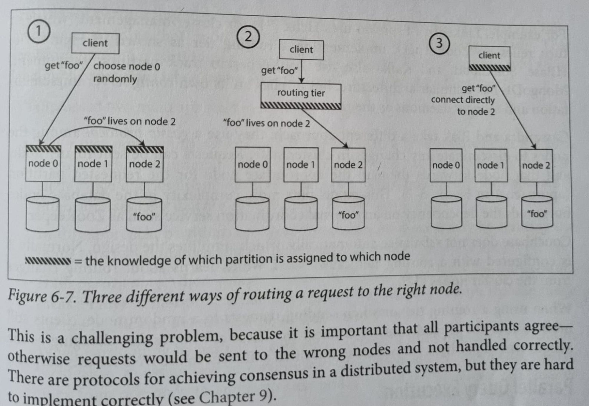

---
tags:
  - db
date: 2024-07-07
publish: true
description: A brief overview of replication and partioning strategies in databases.
---

**Replication** is maintaining copy of this data in case of any outages/data corruption. 

**Partitioning** means splitting your data into different nodes for high availability. 



## Replication

Replicating/Copying data from the master/leader node to its replica nodes. 

Available replication mechanisms : 

### Single Leader Based replication
Ex : DynamoDB

The leader-based replication works under the hood by following one of the below techniques : 

**Statement-based replication** : 
* The leader logs every write request(statement) that it executes and sends that statement log to each of its followers. 

**Write-Ahead log/Physical replication** : 
* Log is an append-only sequence of bytes containing all writes to db. Besides writing to a log to its own WAL, the leader sends it to all of its followers.
* Streaming/Physical replication in [postgres](https://www.postgresql.org/docs/current/warm-standby.html#STREAMING-REPLICATION)
    
**Logical(row-based) log replication** :   
* A logical log is usually a sequence of records describing writes to the db at the granularity of rows means it literally records all the rows that were affected by an insert/delete/update, etc and sends it across to its followers. 
* Logical/CDC replication in [postgres](https://www.postgresql.org/docs/current/logical-replication.html)

**Trigger based replication** : 
* If you want to handle replication by a custom logic on some event/trigger/procedure. The<br> trigger logs any change into a separate table, from which it can be read by an external process<br> 
to apply to the followers. (Ex: Bucardo for postgres).

### Multi Leader Based replication

Instead of a single leader, multiple nodes accept the incoming writes and replicate to their own replica sets.

The main problem to solve is the **Write Conflicts** wherein multiple leaders are performing writes<br> 
concurrently and you don’t know which one to accept. 

Few solutions in resolving these conflicts :
* Conflict-free replicated datatypes [CRDTs](https://www.youtube.com/watch?v=B5NULPSiOGw)
* Mergeable persistent data structure.
* [Operational transformation](https://medium.com/coinmonks/operational-transformations-as-an-algorithm-for-automatic-conflict-resolution-3bf8920ea447)
* Last Write Wins(attach a timestamp/UUID to every write and pick the latest one).
* Version vectors or Vector Clocks 
    * Maintain a version vector per replica per key. Each replica increments its own version number when processing a write, and also keeps track of the version numbers it has seen from each of the other replicas. 
    * This information indicates which values to overwrite and which values to keep as siblings.
* Detecting concurrent writes: The happens before relationship, LWW, using vector clocks, etc.
    * [Partial orders, total orders, Lamport clocks](https://youtu.be/UqY1tF3zxjc?si=E-kY-DkpnXJdImEt)
    * [Vector clocks, FIFO/causal/total ordering](https://youtu.be/5BHizc7BPyE?si=2VPvXhuHDKzijviH)
* [Conflicts resolution](https://drive.googleblog.com/2010/09/whats-different-about-new-google-docs.html) in google docs/calender when multiple people are editing the same document.

### Leaderless replication
Ex : Riak, Cassandra, Dynamo

There is no any leader but rather the client or a coordinator sends writes/reads to all of the available replicas and the truth value is decided based on Quorums. Accept the write/read if `(w+r) > n`

```
where 
-w: every write confirmed by w nodes and
-r:  data read from at least r nodes for each read.
-n: total number of nodes.
Typically n is an odd number and w=r = (n+1)/2
```

But how to make sure that if a failed node comes back online, it will have upto date info? <br>
Below are few mechanisms we can use : 

**Read repair** : 
* When a client makes a read from several nodes in parallel, it can detect any stale response. 
* For eg : If a user gets value 6 from replica3 but value 7 from replicas1 and 2 then, the client detects that replica3 has stale value and writes the newer value back to that replica.

**Write repair/Hinted handoff** : 
* In case any node out of w or r is not reachable for whatever reasons and we cannot achieve the quorum then what to do? 
* Accept the writes anyway, and write them to some nodes that are reachable but aren’t among those w or r nodes where the value usually lives. 
* Once the issue is fixed, any writes that a temporary node accepted on the behalf of another node are sent to the appropriate ones. This is called **handoff**. 

**Anti-entropy process** : 
* Run a background process to look for differences in the data and copy any missing data from one replica to another.

## Replication lag

It is the time between the write is made to a leader and is propagated to its followers to the time when its actually committed to all of its followers. This replication can be synchronous or async. 

**Async** is better for faster read/writes but can result in data inconsistencies if writes are lost ins between. 

**Sync** is a slower process but guarantees data consistency. So in most of the cases you can have few followers using sync and other using async process.
    
How can we tackle replication lag?
    
**Reading your own writes/Read after writes** : 
* Read from the replica which processed your write or route all the requests from the leader(leader contention). You could track the time of the last update and for a minute or two after the last update, keep serving the reads from the leader. 
* Another way is for client to remember the timestamp of its most recent write - then the system can ensure that the replica serving any reads for that user reflects updates at least until the timestamp. 
* If a replica is not sufficiently up to date, either the read can be handled by another replica or query can wait until the replica has caught up. (hampers your read efficiency.)

**Monotonic Reads** : 
* When you read data, you may see an old value; monotonic reads only means that if one user makes several reads in sequence, they will not see time go backward-i.e they will not read older data(from an old replica which hasn’t caught up yet) after previously read newer data. 
* One way to ensure this is each user makes a read from the same replica(different users can read from different replicas), based on the hash of the user ID.

**Consistent Prefix Reads** : 
* If a sequence of writes happens in a certain order, then anyone reading those writes will see them appear in the same order. 
* One solution is to make sure that any writes that are casually related to each other are written to the same partition. (**Casual Consistency**)

## Partitioning

**Partitioning by Key Range** : 
* Storing data on a partition based on range of keys(primary keys) For ex: 1-100 keys can be on one partition. 
* Can efficiently do range scans since records/tuples are in sorted order in each partition.

**Partitioning by Hash** : 
* Distributing data across partitions based on a hash function applied to the key. This ensures an even distribution of data across partitions. 
* Lose the ability to range scans since two adjacent keys could be on different partitions since their hashes differ.

**Partitioning by Consistent hashing** : 
* In case of hash based partitioning, we need to update the hash function everytime there is addition or node failures which is not ideal. This also leads to lot of data movement to the new node.
* Consistent hashing prevents minimizes this data movement by maintainig a chain ring of all available nodes and assigning the keys based on its nearest available node.
* More on consistent hashing : 
  * [Consistent Hashing algorithm](https://highscalability.com/consistent-hashing-algorithm/)
  * [Partitioning Consistent Hashing](https://distributed-computing-musings.com/2022/01/partitioning-consistent-hashing/)

### Partitioning secondary indexes

Your database can also have secondary index along with the primary. We can partition data using this secondary index as well.

Below are the strategies we can use : 

**Document based partitioning** : 
* Local index based wherein each partition has its own secondary indexes, covering documents only in that partition. 
* Slower reads cause it has to check all partitions for a particular value and gather the results(scatter, gather).
* 

**Term based partitioning** : 
* Global index based wherein global secondary index is maintained and those are again partitioned(covering all possible documents for a particular secondary index) and stored on each partition. 
* Faster reads cause you just need to find which secondary index partition your key is present.
* 

More about secondary indexes partitioning [here](https://www.alexdebrie.com/posts/distributed-databases-indexes/)

## Rebalancing Strategies

How we can rebalance the cluster to minimize data movement whenever we add or remove a new node or on node failures!?

**Fixed number of Partitions** : 
* Fix n number of partitions beforehand rebalance/allocate them on new nodes accordingly. Problem arises when the data grows and the partitions get beefier. 
* Examples : Riak, Couchbase, Voldemort, Elasticsearch

**Dynamic Partitioning** : 
* After a partition grows or shrinks beyond a certain limit, they are split into two partitions or merged into single one and assigned to node(s) accordingly.

**Partitioning proportional to the nodes** : 
* Compulsory have fixed number of partitions/node. 
* When a new node joins the cluster, it randomly chooses a fixed number of partitions to split and then takes ownership of half of them leaving the other half on their respective nodes. (Cassandra)
* 


## Request Routing

Deciding which partition on which node has the key or record which you are looking for.



**Rely on nodes** : 
* Allow client to contact any node. If key not present on this node, then it forwards to the correct one. 
* Requires each node to maintain this routing information. Cassandra, Riak uses this setup(**gossip protocol**) for routing requests.

**Routing tier** : 
* Use a [service discovery](http://jasonwilder.com/categories/service-discovery/) to determine which node to route to and using services like zookeeper to keep track of this metadata. 
* Whenever a new node joins the cluster, it registers itself with zookeeper. Used by HBase, SolrCloud.

**Client side** :
* Maintain the routing info on client side and determine beforehand the correct node beforehand to route to.


## Appendix

* Github service disruption due to [replication lag](https://github.blog/2018-10-30-oct21-post-incident-analysis/)
* [Partition approaches](https://distributed-computing-musings.com/2022/01/partitioning-approaches-to-partitioning/)
* [Range partitoning](https://www.aspiring.dev/range-partitioning/)
* How do distributed dbs do [consistent backups](https://www.reddit.com/r/databasedevelopment/comments/18jws00/how_do_distributed_databases_do_consistent_backups/)
* 