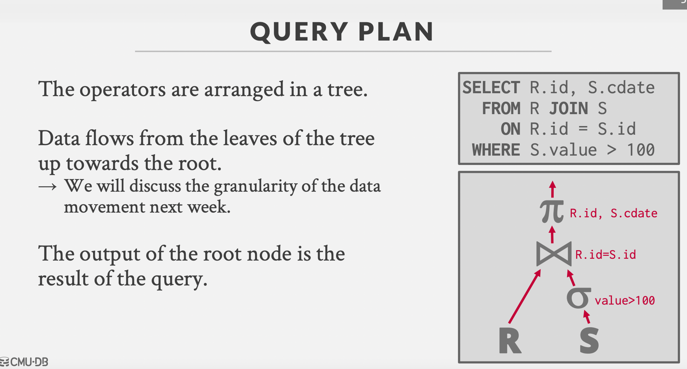
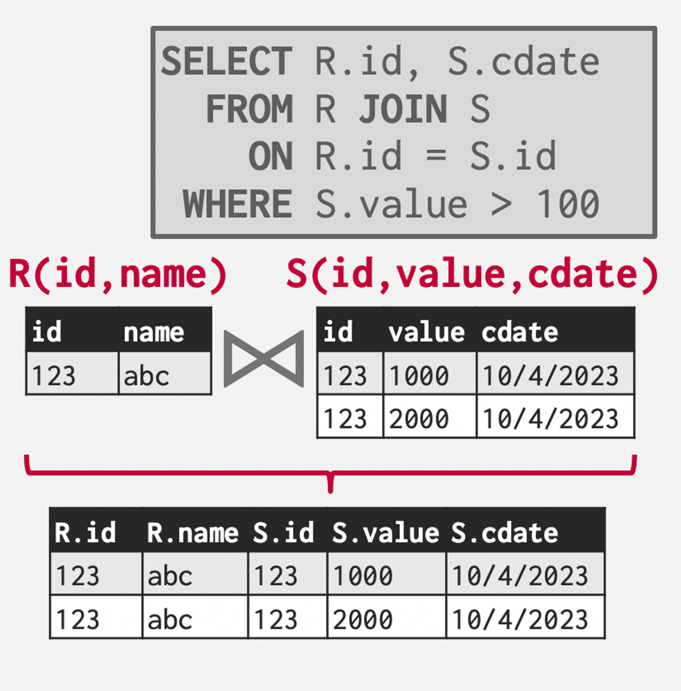
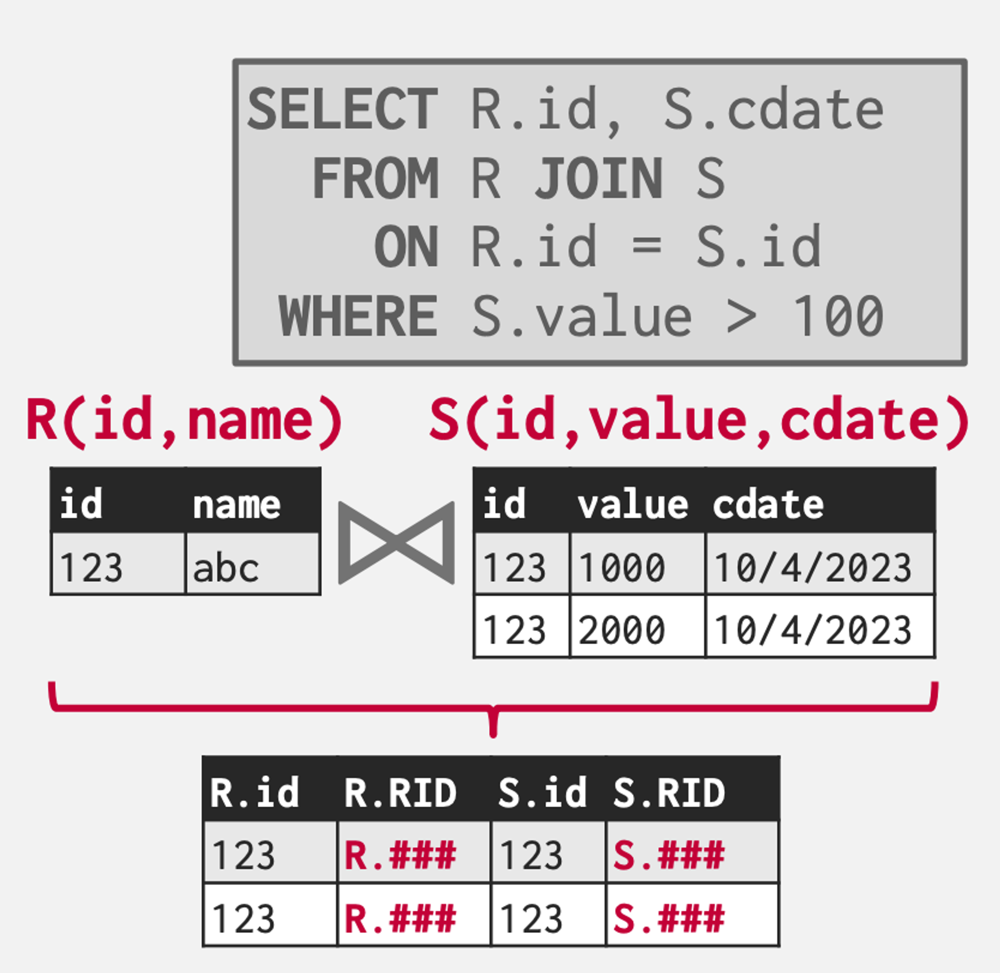
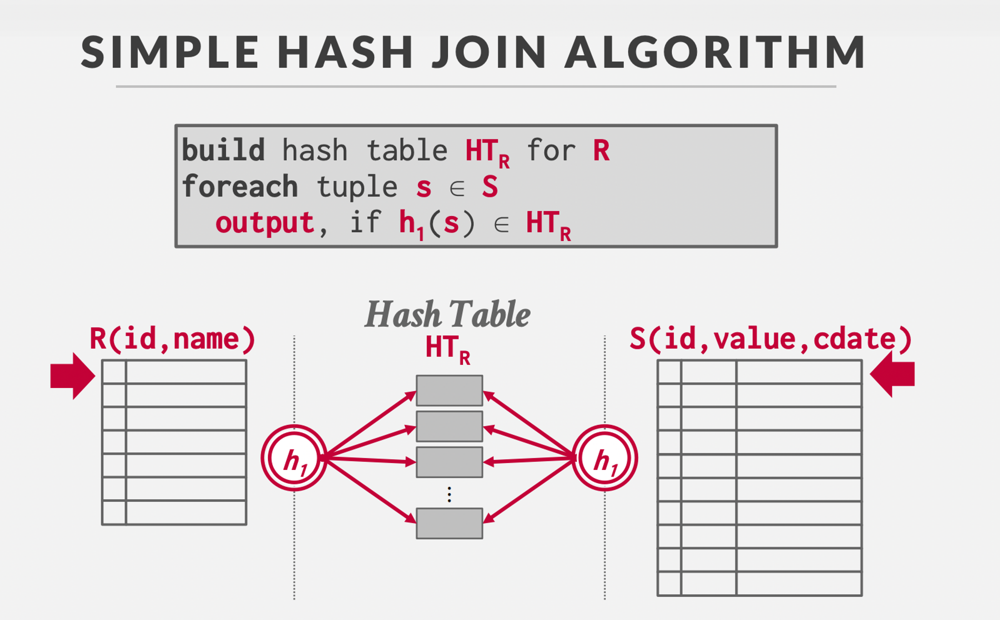

---
tags:
  - cmu
  - db
publish: true
date: 2024-07-08
description: Sorting, Aggregations and Joins algorithms and techniques used in database systems.
---

## Sorting data

How do you sort data that doesn’t fit into memory which is the most occurring scenario in case of database systems?
* [External Merge Sort](https://www.cs.bu.edu/~gkollios/cs660f19/Slides/externalsort.pdf)
* **Phase1-Sorting** - Sort chunks of the data that fit in the memory and write that sorted data into a separate file.
* **Phase2-Merging** - Combine these sorted files into the final complete sorted file.

## Hashing data

How hashing(counterpart of sorting) is used in computing aggregation queries like **GROUP BY**?
* **Phase1-Partition** - Divide tuples into buckets based on the hashed key. Write them out to disk when they get full.
* **Phase2-ReHash** - Build in-memory hash table for each partition and compute the aggregation. 
    * Basically hashing two times, first to form the buckets and second for each bucket/partition, hash the keys. Same keys would hash to same value so you can do aggregation accordingly. 
    * For example, if `(k1, 23)` and `(k2, 24)` hash to the same index `((23,24), 2)` then if you’re doing a `AVG()` then its basically doing (23+24)/2 which we can figure out on how the value/tuple/record is being stored. `2` here being the num keys hashed to the same index.

## Joins

How are joins performed?
* All queries can be seen in the form a tree wherein the output of the root node is final result. 
    
      
* How do we reason about reconciling(collecting different tuples from other tables into a final result) records from different tables in case of joins. There are two ways to:
    * **Early Materialisation** : Wherein we actually copy the tuples/records/rows from the tables into a new output tuple. Subsequent operators don’t have to go back and do another IO cause you already have all the records needed for further processing. 
    
        
    * **Late Materialisation**: Don’t store actual records(since you might not want the extra columns which would be fetched when an entire row is fetched in memory in case of early materialisation), but rather just store some identifier like RecordIDs of the matching tuples so that we can lookup to them later to produce the final result. (Ideal for column stores)
        
    
### Join Algorithms

Different join algorithms(**Joining outer-left table with inner-right table**) : 

* **Nested Loop Joins** : 
    * Just loop over outer table from inner join and checking if a tuple field of an inner table matches with that of an outer table.
    * Pick the smaller table as the outer table. Buffer as much of the outer table as possible. For faster IOs while looping over an inner table, we can use the index of inner table if there is an index on the corresponding id. 
    * Types - Naive, Block, Index.

* **Sort-Merge Join( External Merge Sort)** :
    * Sort both the tables inner and outer using the external merge sort(discussed above) and start merging them by the same merge logic. 
    * So total cost = **sort + merge(M + N) cost.** 

* **Hash Join** : 
    * **Phase1-Build** = Scan the outer relation to build a hash table using the hash function h1 on the join attributions.
    * **Phase2-Probe** = Scan the inner relation and use h1 on each tuple to find out the matching tuple from outer relation since same keys would hash to the same location.
    * Key: Attribute involved in the join, Value: The record tuples. Whether you store actual records(early materialization) or just references/offsets to the records(later materialization)
        
        
    * One optimisation we can do is use bloom filters to find out whether Sid belongs to the hash table to avoid extra lookups. We built the bloom filter while building the hash table on Rids. 
    * What if these hash tables don’t fit into memory:
        1. **Partition Phase** - Hash both tables on the join attribute into partitions. 
        2. **Probe Phase** - Compare tuples in corresponding partitions for each table.
    * Simple, GRACE(Externally Partitioned), Hybrid.

## Relevant Readings

Sorting and Aggregations Algorithms : 
* [Youtube](https://www.youtube.com/watch?v=DOu7SVUbuuM)
* [Slides](https://15445.courses.cs.cmu.edu/fall2023/slides/10-sorting.pdf)
* [Notes](https://15445.courses.cs.cmu.edu/fall2023/notes/10-sorting.pdf)

Joins Algorithms : 
* [Youtube](https://www.youtube.com/watch?v=RFaOmqxJf_M)
* [Slides](https://15445.courses.cs.cmu.edu/fall2023/slides/11-joins.pdf)
* [Notes](https://15445.courses.cs.cmu.edu/fall2023/notes/11-joins.pdf)

