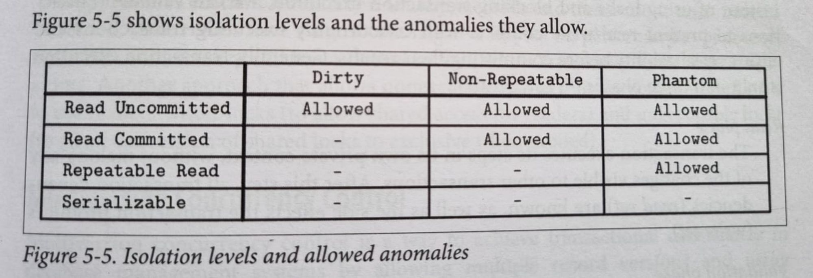

---
tags:
  - db
date: 2024-07-07
publish: true
description: A brief overview of transactions control mechanisms in a single node database as compared to those spanning across more than one nodes in a distributed setup.
---
A brief overview of transactions control mechanisms in a single node database as compared to those spanning across more than one nodes in a distributed setup.

## Prerequisites

**ACID** : Terminology used to define transactions guarantees in a single node db.  
**CAP** : Terminology used for a distributed architecture. 

**Consistency** in ACID ≠ **Consistency** in CAP. Don’t get confused by the acronyms. C in CAP actually stands for **Linearizability** (GLOBAL ordering of the transactions wherein the transactions are now being executed on multiple nodes at the same time).

Whenever you’re dealing with transactions and concurrency control, always remember this cycle: 
* `read-modify-write` policy wherein **most often transactions are first reading a value, modifying the value and writing the value back**. 

* This is the most common scenario you get to see weird results if multiple transactions are executing and we don’t have proper isolations.

I have always thought of **Isolation ~ Consistency.** How do you achieve consistency between your transactions? By making sure they are isolated from each other, even if they are operating on same record, final record value must be consistent. 

Which anomalies we are trying to avoid so that our db records are consistent?

**Read anomalies** :
* **Dirty reads** : Transaction reading uncommitted data. 

* **Non-Repeatable reads**: Transaction T1 reading data twice and getting different results each time before committing cause some other transaction T2 modified the data after T1 first read and T2 committed.

* **Phantom reads**: Non-repeatable reads but just for range queries wherein you receive different set of results on querying the same set of rows.

**Write Anomalies** :
* **Dirty write** : Update/write a value based on a dirty read(value read is not yet committed).

* **Lost update** : T1 and T2 both accessing the value and value written by T1 may get overridden by T2 since both are unaware of each other.

* **Write skew** : When individual transaction respects required invariants, but their combination(after these transactions commit) do not satisfy these invariants.   

**Last Note** : There are tons of techniques on how distributed databases execute transactions. I have tried to explain the basic ones, which I understood after reading a bit about them. 

## Transactions in a traditional single node database
ex: postgres, mysql, sqloracle, etc

### Consistency levels

**Note** : Repeatable Read = Read Replicated = Snapshot isolation

Detailed hierarchy [here](https://jepsen.io/consistency)

So basically Isolation levels. **Lowest to Highest**.

**Read Uncommitted** : All of them may happen.

**Read Committed** : Phantoms and unrepeatable reads may happen.

**Repeatable reads or Read Replicated or Snapshot Isolation** : 
* Write skews might happen. It is sort a generalisation of the **lost update problem**. 
* It can occur if two transactions read the same objects `in case of snapshot isolation, two different snapshots/objects`, and then update those objects leading updation of the two different versions of same object leaving it in inconsistent state. 
* In special case where different transaction update the same object, you get a dirty write or lost update anomaly `depending on the timing`.

**Serialisable Isolation** : No phantoms, all reads repeatable, no dirty reads. transactions could get reordered.

**Serialisable Snapshot Isolation** : 
* We have implementations of serialisability that don’t perform well`two phase locking` or don’t scale well `serial execution`. 
* On the other hand, we have weak isolation levels that have good performance, but are prone to various race conditions `write skews, lost updates, phantoms, etc.` SSI is like the common ground between them.
* SSI is sorta optimistic concurrency as in instead of blocking if something potentially dangerous happens, transactions continue anyway, in the hope that everything will turn out right. 
* When a transaction wants to commit, the db checks whether isolation was violated and if so, its aborted and retried. All reads are made from a consistent snapshot.

### Transactions

**Concurrency Control** mechanisms.

These all strive to enforce **Serialisability** which guarantees an ordering of the transactions. Once ordering is enforced, you don’t have to worry about any inconsistent updates.

**[Serialisability](https://jepsen.io/consistency/models/sequential)** : 
* Serialisability enforces local ordering i.e the order is consistent from individual records or a client’s pov.

* Operations can be ordered in different ways(depending on the arrival order, or even arbitrarily in case of two writes arrive simultaneously), but all processes observe operations in the same order.

* [More here](https://www.cockroachlabs.com/blog/acid-rain/)

**Optimistic** : Operates in three phases :

**Read Phase, Validation Phase, Writes Phase.** 
* Before committing the value(write phase), validations are performed to guarantee that no any transaction violate isolation guarantees and if they do, they are rolled back. `This feels a lot like a CAS operation`
* This is used in SSI to check for the [read-write dependency](https://justinjaffray.com/what-does-write-skew-look-like/)while executing transactions.

**Pessimistic** :

* **Two phase locking** : 
    * Default in most of the databases. 
    * Take an exclusive lock **only** when you are about to write. Readers don’t block writers and vice versa. Multiple readers share the same lock. 
    * Check reader-writer lock. Ex: Locking in [sqlite](https://www.sqlite.org/lockingv3.html#locking).
    
* **Actual Serial Execution** : 
    * Executing one transaction at a time using a **single thread** much like how redis does.
    * Use **stored procedures** to group multiple transactions together and the db will execute it one by one.
    * Using a single thread causes contention since it won't scale well and stored procedures can lead to high memory usage if multiple transactions are pulling rows in memory to issue the updates.

* **Timestamp ordering** :  
    * Slap each transaction with a timestamp and check for **happens before** relationship to find out which transaction started before/after which. 
    
    * [Timestamp Ordering](https://15445.courses.cs.cmu.edu/fall2023/notes/17-timestampordering.pdf)

**MVCC** : 
* [MVCC in postgres](https://www.postgresql.org/docs/current/mvcc.html)

* How [write skews](https://vladmihalcea.com/write-skew-2pl-mvcc/) resort to using locking `pessimistic concurrency control` even in MVCC.

## Transactions in a distributed database setup
ex: cockroachdb, spanner, yugabyte, mongo, etc.

### Consistency levels

Since now the transactions span multiple nodes, we need to find a way to establish an ordering between them to execute them atomically. This requires co-ordination between these transactions.

So basically Isolation levels : 

**Strict Consistency** : 
* It considers a **global clock** for ordering of events. Theoretically not possible since each node/server has its own clock and they may not be in sync. There are different techniques to synchronise them like **Precision Time Protocol, Network Time Protocol.**
* Some databases define a global clock by themselves like Spanner has TrueTime or WallClock concept for establishing ordering of transactions.

**Linearizability** : 
* Its the strongest consistency model under which, the effects of the write become visible to all readers **exactly once at the start or at the end**, and no client can observe state transitions or side effects of partial(i.e unfinished, still in-flight) or incomplete(interrupted before completion) write operations.
* [linearizability vs serializability](http://www.bailis.org/blog/linearizability-versus-serializability/)
* Both serialize transactions but in serializability transactions can be reordered for ex: T1 might be executed after T2 even if T1 was issued before but linearizability makes sure that T2 follows T1.

**Casual Consistency** : 
* All processes which are casually related are processed in order. Even if they arrive out of order, the server buffers them and reorders them based on the **vector** clocks and executes them in the order. ${M1(0,t1), M_2(M1,t2), M_3(M2, t3)}$
* Casual Consistency in [MariaDB](https://mariadb.org/causal-consistency/)

**Session Models** : 
* State of the distributed system from a client’s perspective; how client observes the state while firing reads and writes. 
* There are multiple session models like **Read-your-Writes, Monotonic reads, Monotonic writes, Writes-follows-reads.**

**Eventual Consistency** : Most of the dbs have eventual consistency.
* If there are no additional updates performed against the data item, **eventually** all **reads** return latest written value. Updates(replication) are propagated **asynchronously**. 
* Conflicts from diverged replicas are resolved using techniques like **Last Write Wins(LWW), Vector Clocks, CRDTS, etc.** 

**Tuneable Consistency** : 
* **Eventual** Consistency systems implement tuneable consistency, where data is replicated, read and written using **quorums**. (R=W ≥ $n/2+1$) 
* $(R+W)>N$ can guarantee returning most recent write/read. Like in **mongodb** where you can specify read, write concern for every transaction you fire.

### Transactions
Lets see few distributed transactions, consensus algorithms which provide **linearizable** guarantees :

**Two-Phase Commit**
* **First phase** : Decided value is distributed and votes are collected. 
* **Second phase** : Nodes just flip the switch and commit the value when co-ordinator signals.
* Two entities :
    - **Leader** : Holds the state, collects the votes, and is primary point of reference for agreement rounds.
    - **Cohort** : Rest of the node partitions operating over disjoint datasets against which the transactions are performed. Both keep an operation log of every transaction executed
* Ex: 2PC KIP Support in [kafka](https://cwiki.apache.org/confluence/display/KAFKA/KIP-939%3A+Support+Participation+in+2PC)

**Three-Phase Commit** 
* Two phase commit but mitigates the co-ordinator failure. 
* **Note:** These transactions require **ack** from **ALL** the **nodes** in the **cohort** to proceed ahead with the commitment.

**Calvin** 
* Deterministic execution of the transactions. Ex: faunadb, their transactional model takes inspiration from Calvin.
* [Calvin Paper](https://blog.acolyer.org/2019/03/29/calvin-fast-distributed-transactions-for-partitioned-database-systems/) explained.
* Calvin [summarised](https://www.mydistributed.systems/2020/08/calvin.html)

[**Spanner**](https://www.mydistributed.systems/2020/08/google-spanner.html) style transaction.

**Percolator** style transaction : Transactional API on top of Big Table
* [Percolator](https://stephenholiday.com/notes/percolator/)
* Percolator inspired [transactions](https://tikv.org/deep-dive/distributed-transaction/percolator/) in TiKV.

**RAMP** : 
* It focuses on how we can avoid co-ordination between the different nodes so that we can execute transactions faster and consistent.
* [RAMP Paper](https://blog.acolyer.org/2015/03/19/coordination-avoidance-in-database-systems/) explained.
* [Atomic Visibility](http://www.bailis.org/blog/scalable-atomic-visibility-with-ramp-transactions/) with RAMP.
	
**Consensus** algorithms are used for not only **replicating the state** but also for 
**establishing ordering** between those transactions and **co-ordination** between your nodes.

Different consensus algorithms follow more or less the same structure, leader propagates the updates to the followers and commits on ack. Involves two steps, **Prepare** and **Commit.**

[**Zookeeper atomic broadcast**](https://zookeeper.apache.org/doc/r3.4.13/zookeeperInternals.html)

**Paxos and its variants** : 
* Setup :
    * **Proposers** : Receive values from clients, create proposals to accept these values and attempt to collect votes(yes or no) from acceptors.
    * **Acceptors** : Vote to accept or reject values proposed by the proposers. Can have multiple acceptors but quorum of them is required to accept the proposal.
    * **Learners** : Take role of replicas, storing the outcomes of accepted proposals.
* Takes place in two steps: **voting/propose** phase and **replication/commit** phase.
* For committing, only a `quorum(n/2+1)` of followers is required as compared to **ALL** in 2PC which makes paxos more **available than** 2PC/3PC protocols.

**Raft.**
* Setup :
    * **Candidate** : Node has to transition to the candidate state to be elected as the leader.
    * **Leader** : Temporary(upto its term) cluster leader handling client reqs and replicating the same to the followers.
    * **Follower** : Passive participant persisting log records of the received reqs.
* **Partial ORDERING of the operations** are guaranteed by a monotonically increasing **epoch/term ID** issued by the leader. Each record can be **uniquely** identified by this term ID and the corresponding index of that record.

**Accord.** : Protcol used in [Cassandra](https://li-boxuan.medium.com/distributed-transaction-in-database-from-epaxos-to-accord-6de7999ad08e)
                
Databases use a consensus algos to execute these transactions to ensure ordering is maintained and the data written is consistent even in the presence of leader failures, network failures, etc.
* Ex: **Spanner** does **2PC+2PL** over paxos groups. i.e each shard/node is a paxos leader and its replicas act as followers. 
* Transactions use 2PC to co-ordinate between these leaders of different nodes and consensus to handle leader failures, replication, etc.

This a lot to process and may not seem coherent. But I have jotted down some points I have understood till now.